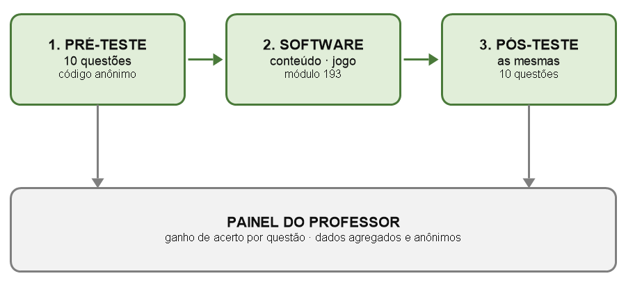

# Projeto Cordilheira — Resumo Expandido (texto para o Anexo 1.3)

> **Como usar:** este é o conteúdo. A formatação (margens, duas colunas, Times 10, cabeçalho/rodapé) sai pronta do `.docx` do Anexo 1.3 — cole o texto lá dentro sem mexer no layout.
> **Campos entre `[colchetes]` precisam ser preenchidos por vocês.**

---

## Cabeçalho

**Título (caixa alta, negrito, centralizado, tamanho 12):**

PROJETO CORDILHEIRA: SOFTWARE EDUCACIONAL PARA PREVENÇÃO DE QUEIMADAS NO PANTANAL COM MEDIÇÃO AUTOMATIZADA DA APRENDIZAGEM

**Autores:** [Nome da estudante 1], [Nome da estudante 2], João Felipe Moreira de Souza

**Instituição:** Escola Estadual Júlia Gonçalves Passarinho – Corumbá – MS

**E-mails:** [email da estudante 1], [email da estudante 2], jfelipe7.souza@gmail.com

**Área/Subárea:** Ciências Humanas, Sociais Aplicadas, Linguística e Artes (CHSAL) – Educação — *(à esquerda)*
**Tipo de Pesquisa:** Científica — *(à direita)*

**Palavras-chave:** educação ambiental, queimadas, Pantanal

---

## Introdução

O Pantanal, maior planície alagável do planeta, vem sofrendo perdas sucessivas por incêndios florestais. Em 2020, a área queimada no bioma foi **376% superior à média registrada entre 2003 e 2019** (GARCIA et al., 2021), no episódio descrito como o maior desastre por fogo já observado na região (LIBONATI et al., 2020). Pletsch et al. (2021) associam o evento à combinação entre a maior seca em sessenta anos e a fragilização das políticas ambientais. Corumbá, município onde este trabalho foi desenvolvido, está inserida na área atingida.

O dado que orienta esta pesquisa é a origem do fogo: os incêndios no Pantanal estão associados a atividades humanas e ao manejo inadequado do fogo, e não a causas naturais (GARCIA et al., 2021). Se a causa é o comportamento humano, a educação deixa de ser apenas conscientização e passa a ser **uma tecnologia de prevenção**, tal como prevê a Política Nacional de Educação Ambiental ao definir a educação ambiental como componente essencial e permanente da educação nacional (BRASIL, 1999). Soma-se a isso o fato de que o tempo entre o início de um foco e o acionamento do Corpo de Bombeiros é determinante para que ele não se torne incontrolável: quanto mais cedo o alerta, menor a área queimada.

Existem materiais de educação ambiental sobre queimadas, mas eles apresentam duas lacunas. A primeira é a ausência de vínculo territorial: são materiais genéricos, que não tratam do bioma em que a criança vive, dos animais que ela conhece nem do rio que ela atravessa. A segunda, e mais relevante para a pesquisa, é a **ausência de medição**: distribui-se o material e presume-se que houve aprendizado, sem verificar se de fato houve.

Este trabalho parte da seguinte hipótese: *uma criança dos anos iniciais, após interagir por tempo reduzido com um software educacional contextualizado no Pantanal, apresenta ganho mensurável de conhecimento sobre as causas das queimadas e sobre o procedimento correto de acionamento da emergência (193).*

**Objetivo geral:** desenvolver e avaliar um software educacional de prevenção a queimadas no Pantanal capaz de medir automaticamente o aprendizado de seus usuários.

**Objetivos específicos:** (a) desenvolver uma aplicação web com conteúdo, imagens e jogo sobre queimadas no bioma pantaneiro; (b) incorporar ao próprio software um instrumento de avaliação pré e pós-uso; (c) aplicar o software a um grupo de estudantes e mensurar o ganho de aprendizagem; (d) identificar quais conteúdos o software ensina com eficácia e quais não ensina.

## Metodologia

A pesquisa é de natureza aplicada, com abordagem quantitativa e delineamento pré-experimental do tipo **pré-teste/pós-teste com grupo único**.

**Etapa 1 — Desenvolvimento.** Foi construída uma aplicação web em HTML, CSS e JavaScript, de execução local e sem necessidade de conexão com a internet. O sistema reúne três módulos: conteúdo informativo com imagens do bioma; um jogo digital ("Guardiões do Pantanal"), em que o jogador identifica situações de risco de incêndio; e um módulo de emergência, dedicado ao reconhecimento de sinais de fogo e ao acionamento do número 193 do Corpo de Bombeiros.

**Etapa 2 — Instrumento de medição.** O próprio software funciona como instrumento de coleta. Ao iniciar, o participante recebe um **código alfanumérico anônimo**, gerado pelo sistema, sem qualquer dado que permita identificá-lo, e responde a **10 questões objetivas** (pré-teste). Após a interação com os módulos, o mesmo conjunto de questões é reaplicado (pós-teste). O sistema registra acertos, erros e o desempenho por questão, e consolida os dados de forma agregada em um painel de resultados.

*(A Figura 1 entra aqui no `.docx`.)*

**Figura 1 - Desenho da medição embutida no software**

Fonte: Próprio Autor (2026)

**Etapa 3 — Aplicação.** O software foi aplicado a **30 estudantes de 8 a 11 anos**, matriculados nos anos iniciais do Ensino Fundamental, em [nome da escola], em [mês] de 2026. Cada sessão teve duração aproximada de **25 minutos** por participante, incluindo pré-teste, interação com os módulos e pós-teste.

**Etapa 4 — Análise.** Comparou-se o percentual de acerto no pré-teste e no pós-teste, no total e questão a questão, calculando-se o ganho absoluto de aprendizagem. Nenhum nome, imagem ou dado pessoal foi coletado ou armazenado, e os resultados são tratados exclusivamente de forma agregada.

## Resultados e Análise

*(Preencher com os dados reais da aplicação. Modelo abaixo.)*

O percentual médio de acerto passou de **[XX]%** no pré-teste para **[XX]%** no pós-teste, ganho absoluto de **[XX] pontos percentuais**.

**Tabela 1. Percentual de acerto por conteúdo, antes e depois do uso do software (n = 30)**

| Conteúdo avaliado | Pré | Pós | Ganho |
|---|---|---|---|
| Número de emergência do Corpo de Bombeiros (193) | [XX]% | [XX]% | [XX] p.p. |
| Causas humanas das queimadas | [XX]% | [XX]% | [XX] p.p. |
| Procedimento ao avistar fumaça | [XX]% | [XX]% | [XX] p.p. |
| Impacto das queimadas na fauna | [XX]% | [XX]% | [XX] p.p. |
| **Média geral** | **[XX]%** | **[XX]%** | **[XX] p.p.** |

Fonte: Próprio Autor (2026)

O maior ganho ocorreu em [conteúdo], o que indica que [interpretação]. Já em [conteúdo], o ganho foi de apenas [XX] pontos percentuais — resultado que aponta uma limitação do material desenvolvido e que orientou [a revisão feita / a proposta de revisão] desse módulo.

## Considerações Finais

Os dados obtidos sustentam a hipótese inicial: houve ganho mensurável de conhecimento após interação breve com o software. O resultado mais relevante do ponto de vista da prevenção é o referente ao acionamento do 193, uma vez que a notificação precoce é fator determinante no controle de incêndios florestais.

Cabe delimitar o alcance da conclusão. O delineamento com grupo único não permite isolar o efeito do software de outros fatores presentes na aplicação, e a medição é imediata, não avaliando a retenção do conhecimento ao longo do tempo. O trabalho também não afirma redução de focos de incêndio: o que se demonstra é ganho de conhecimento e de capacidade de acionamento, condição necessária — porém não suficiente — para a prevenção.

Como continuidade, propõe-se a aplicação com grupo de controle, a reaplicação do pós-teste após 30 dias para verificação de retenção, a validação do conteúdo junto ao Corpo de Bombeiros Militar de Mato Grosso do Sul e a ampliação da amostra para outras escolas de Corumbá.

## Agradecimentos

*(opcional — citar a escola, o Corpo de Bombeiros se houver validação, e órgão de fomento se houver bolsa)*

## Referências

> Todas conferidas na fonte. A única pendência é a data de acesso ao INPE.

- BRASIL. **Lei nº 9.795, de 27 de abril de 1999.** Dispõe sobre a educação ambiental, institui a Política Nacional de Educação Ambiental e dá outras providências. Diário Oficial da União: seção 1, Brasília, DF, 28 abr. 1999.
- BRASIL. Ministério da Saúde. Conselho Nacional de Saúde. **Resolução nº 510, de 7 de abril de 2016.** Diário Oficial da União: seção 1, Brasília, DF, 24 maio 2016.
- GARCIA, Letícia Couto *et al.* Record-breaking wildfires in the world's largest continuous tropical wetland: integrative fire management is urgently needed for both biodiversity and humans. **Journal of Environmental Management**, v. 293, art. 112870, 2021. DOI: 10.1016/j.jenvman.2021.112870.
- INSTITUTO NACIONAL DE PESQUISAS ESPACIAIS. **Programa Queimadas: banco de dados de queimadas.** São José dos Campos: INPE, 2026. Disponível em: https://terrabrasilis.dpi.inpe.br/queimadas/. Acesso em: [dia] [mês] 2026.
- LIBONATI, Renata; DACAMARA, Carlos C.; PERES, Leonardo F.; CARVALHO, Lino A. Sander de; GARCIA, Letícia C. Rescue Brazil's burning Pantanal wetlands. **Nature**, v. 588, n. 7837, p. 217-219, 2020. DOI: 10.1038/d41586-020-03464-1.
- PLETSCH, Mikhaela A. J. S. *et al.* The 2020 Brazilian Pantanal fires. **Anais da Academia Brasileira de Ciências**, v. 93, n. 3, art. e20210077, 2021. DOI: 10.1590/0001-3765202120210077.

## Seção opcional (não conta nas 2 páginas)

**CORDILHEIRA PROJECT: EDUCATIONAL SOFTWARE FOR WILDFIRE PREVENTION IN THE PANTANAL WITH AUTOMATED LEARNING MEASUREMENT**

*Abstract:* Wildfires in the Pantanal are associated with human activity, and the time elapsed between ignition and the emergency call to the fire brigade is decisive for the extent of the burned area. This study develops and evaluates an educational software application, web-based and able to run offline, addressing wildfire prevention in the Pantanal biome. Its distinctive feature is that the system itself measures learning: each participant answers a 10-item questionnaire before and after using the application, identified only by an anonymous code, and the software computes the gain in correct answers for each content area. The application was tested with 30 children aged 8 to 11 in Corumbá, Brazil. Results are reported by content area, including those in which the software failed to produce a relevant gain.

*Keywords:* environmental education, wildfires, Pantanal

**PROYECTO CORDILLERA: SOFTWARE EDUCATIVO PARA LA PREVENCIÓN DE INCENDIOS EN EL PANTANAL CON MEDICIÓN AUTOMATIZADA DEL APRENDIZAJE**

*Resumen:* Los incendios del Pantanal están asociados a la actividad humana, y el tiempo transcurrido hasta el aviso al Cuerpo de Bomberos determina la extensión del área quemada. Este trabajo desarrolla y evalúa un software educativo, de acceso web y funcionamiento sin conexión, sobre la prevención de incendios en el bioma pantanero. Su rasgo distintivo es que el propio sistema mide el aprendizaje: cada participante responde un cuestionario de 10 preguntas antes y después de usarlo, identificado únicamente por un código anónimo, y el software calcula la ganancia de aciertos por contenido. La aplicación se probó con 30 niños de 8 a 11 años en Corumbá, Brasil. Los resultados se presentan por contenido, incluidos aquellos en los que el software no produjo una ganancia relevante.

*Palabras clave:* educación ambiental, incendios, Pantanal

---

## Checklist específico deste resumo

- [ ] Confirmar as **datas de submissão** no edital específico da FECIPAN (selecao.ifms.edu.br) — nada mais importa antes disso
- [ ] Aplicar o software com os 30 participantes e substituir **todos** os `[XX]` por dados reais (item 5.3.2: resumo sem resultado perde prioridade)
- [ ] Preencher nome da escola, mês da aplicação e data de acesso ao INPE
- [ ] Confirmar por e-mail com a comissão (fecipan@ifms.edu.br) o enquadramento ético — ver a seção sobre isso no roteiro
- [ ] Tabela 1 com legenda **antes** e fonte **depois** (já está assim no `.docx`)
