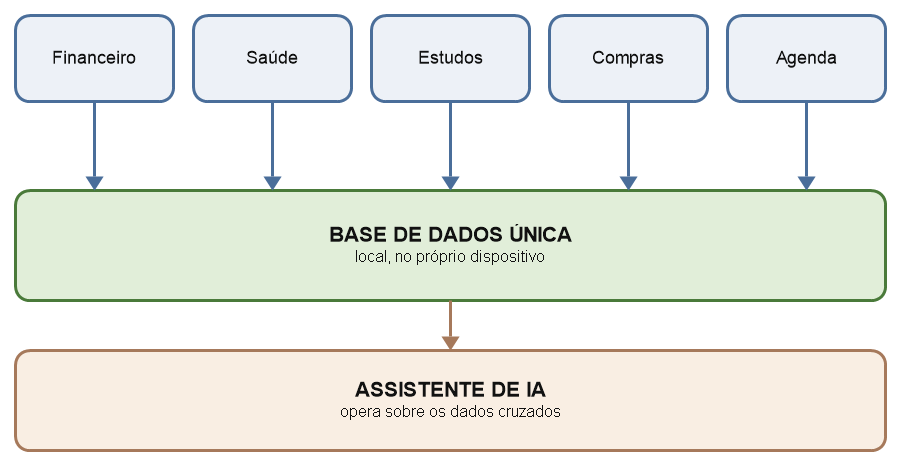

# Projeto Elo — Resumo Expandido (conteúdo do Anexo 1.3)

> Campos entre `[colchetes]` precisam ser preenchidos por vocês.
> Se mantiverem o nome **LifeNetwork**, é só substituir "Elo" no texto todo.

---

## Cabeçalho

**Título:** ELO: APLICATIVO INTEGRADOR DAS ROTINAS DIÁRIAS COM ASSISTENTE DE INTELIGÊNCIA ARTIFICIAL

**Autores:** [Nome da estudante 1], [Nome da estudante 2], João Felipe Moreira de Souza

**Instituição:** Escola Estadual Júlia Gonçalves Passarinho – Corumbá-MS

**Área/Subárea:** MDIS – Multidisciplinar · **Tipo de Pesquisa:** Tecnológica

**Palavras-chave:** aplicativo móvel, organização pessoal, integração de dados

---

## Introdução

A rotina de uma pessoa não é dividida em áreas isoladas, mas as ferramentas que ela usa para organizar essa rotina são. Para controlar gastos, usa-se um aplicativo; para lembrar de consultas e medicamentos, outro; para estudos, listas de compras e compromissos, outros três. Cada um resolve bem a própria área e ignora completamente as demais.

Aplicativos que reúnem várias funções em um só lugar existem. O que se observa, porém, é que eles costumam **justapor módulos independentes**, sem que os dados de um conversem com os de outro: a lista de compras não conhece o orçamento do mês, e o cronograma de estudos não sabe que há uma consulta médica marcada no mesmo horário. A integração continua sendo feita manualmente pelo próprio usuário, que precisa manter na memória aquilo que os sistemas não cruzam. Jones (2007) descreve esse esforço como gestão pessoal da informação, atividade que recai sobre o indivíduo quando as ferramentas não se articulam entre si.

Há ainda um custo de alternância. Mark, Gudith e Klocke (2008) demonstraram que interromper uma atividade para retomá-la depois leva o usuário a trabalhar mais rápido, porém com mais estresse, pressão de tempo e esforço percebido. Cada troca de aplicativo em uma tarefa cotidiana é uma interrupção dessa natureza.

Essa carga é uma das razões pelas quais sistemas de organização pessoal são abandonados. Em levantamento realizado por esta pesquisa com **60 pessoas** de Corumbá, de forma anônima, os participantes declararam utilizar, em média, [X] aplicativos distintos para organizar a rotina, e [Y]% afirmaram já ter abandonado algum sistema de organização que haviam começado a usar.

A hipótese deste trabalho é que **o ganho não está em reunir muitas áreas, e sim em fazer os dados dessas áreas se cruzarem**. Um aplicativo único, em que o registro de um gasto alimenta o planejamento financeiro, a lista de compras respeita o orçamento e a agenda considera saúde e estudos ao mesmo tempo, reduz o esforço de organização de forma mensurável.

**Objetivo geral:** desenvolver e avaliar o Elo, aplicativo que integra em uma única base de dados as áreas financeira, de saúde, de estudos, de compras e de organização da rotina, com uma camada de inteligência artificial que opera sobre os dados cruzados.

**Objetivos específicos:** (a) levantar como as pessoas organizam hoje a própria rotina e quantas ferramentas utilizam; (b) desenvolver o protótipo funcional com os módulos integrados; (c) implementar o assistente que gera sugestões a partir da combinação de dados de módulos diferentes; (d) medir o tempo e o número de trocas de aplicativo necessários para executar tarefas cotidianas, comparando o Elo com o uso de aplicativos separados; e (e) avaliar a usabilidade do protótipo junto a usuários reais.

## Metodologia

Pesquisa aplicada de natureza tecnológica, desenvolvida em quatro etapas.

**Etapa 1 – Diagnóstico.** Aplicou-se questionário anônimo a **60 participantes**, sem coleta de nome ou de qualquer dado identificável, investigando quais ferramentas utilizam para organizar a rotina, quantas utilizam simultaneamente e quais dificuldades enfrentam.

**Etapa 2 – Desenvolvimento.** O protótipo foi desenvolvido em [tecnologia utilizada], com base de dados única e local. São seis módulos: financeiro (registro de receitas, despesas e orçamento); saúde (consultas, medicamentos e hábitos); estudos (cronograma e acompanhamento de tarefas); compras (listas vinculadas ao orçamento); organização (agenda unificada); e o assistente de inteligência artificial.

**Etapa 3 – Camada de integração.** É o núcleo do projeto. Diferentemente de módulos independentes, os dados são gravados em uma base única, o que permite relações entre áreas: a lista de compras consulta o saldo previsto do mês antes de sugerir um item; a agenda evita marcar estudo sobre um compromisso de saúde; o assistente lê o conjunto e produz recomendações que nenhum módulo isolado poderia produzir, como sinalizar que um gasto recorrente compromete uma meta ou que a carga de estudos está concentrada em um único dia.

*(A Figura 1 entra aqui no `.docx`.)*

**Figura 1 - Arquitetura de integração do Elo**

Fonte: Próprio Autor (2026)

**Etapa 4 – Avaliação.** Foram definidas **quatro tarefas** cotidianas representativas: registrar um gasto, agendar um compromisso, incluir um item na lista de compras respeitando o orçamento e consultar a rotina do dia. Cada tarefa foi executada por **20 participantes** de duas formas: utilizando os aplicativos que já usam e utilizando o Elo. Cronometrou-se o tempo de conclusão e contou-se o número de trocas de aplicativo. Ao final, os participantes responderam à *System Usability Scale* (BROOKE, 1996), instrumento padronizado de dez itens que produz uma pontuação de 0 a 100; adotou-se como referência de interpretação a escala proposta por Bangor, Kortum e Miller (2008), na qual valores próximos a **68** correspondem à média dos sistemas avaliados. A participação foi anônima, identificada apenas por código.

**Tratamento dos dados.** O aplicativo lida com informações sensíveis, de saúde e financeiras. Adotou-se, por decisão de projeto, armazenamento local no próprio dispositivo, sem envio a servidores externos, em conformidade com a Lei Geral de Proteção de Dados. Os dados da avaliação foram coletados de forma anônima e analisados de forma agregada.

## Resultados e Análise

O diagnóstico com 60 participantes indicou uso médio de [X] aplicativos por pessoa para tarefas de organização. A Tabela 1 apresenta o desempenho nas tarefas cronometradas com os 20 participantes do teste de usabilidade.

**Tabela 1. Tempo de execução e trocas de aplicativo por tarefa (n = 20)**

| Tarefa | Apps separados | Elo | Redução |
|---|---|---|---|
| Registrar um gasto | [XX] s | [XX] s | [XX]% |
| Agendar compromisso | [XX] s | [XX] s | [XX]% |
| Item na lista dentro do orçamento | [XX] s | [XX] s | [XX]% |
| Consultar a rotina do dia | [XX] s | [XX] s | [XX]% |
| **Média** | **[XX] s** | **[XX] s** | **[XX]%** |
| Trocas de aplicativo (total) | [XX] | 0 | — |

Fonte: Próprio Autor (2026)

A maior diferença ocorreu em [tarefa], justamente a que depende de informação de mais de uma área — resultado que sustenta a hipótese de que o ganho vem da integração, e não do simples agrupamento de funções. A pontuação SUS obtida foi de **[XX]**, o que classifica a usabilidade do protótipo como [classificação].

## Considerações Finais

Os dados obtidos sustentam a hipótese: a redução de tempo foi maior nas tarefas que exigem informação de áreas distintas, o que indica que o benefício está na comunicação entre os módulos e não na quantidade deles.

Cabe delimitar o alcance. Trata-se de protótipo avaliado com amostra reduzida e por conveniência, o que não permite generalização. O teste comparativo também favorece parcialmente o Elo, uma vez que as tarefas foram definidas pelos próprios autores; a familiaridade prévia dos participantes com seus aplicativos habituais atua em sentido contrário. O assistente depende do volume de dados que o usuário registra, sendo menos útil nos primeiros dias de uso.

Como continuidade, propõem-se o teste com amostra maior e tarefas definidas por terceiros, a avaliação do uso continuado ao longo de semanas e o aprofundamento das regras do assistente.

## Referências

> Todas conferidas na fonte.

- BANGOR, Aaron; KORTUM, Philip T.; MILLER, James T. An empirical evaluation of the System Usability Scale. **International Journal of Human-Computer Interaction**, v. 24, n. 6, p. 574-594, 2008. DOI: 10.1080/10447310802205776.
- BRASIL. **Lei nº 13.709, de 14 de agosto de 2018.** Lei Geral de Proteção de Dados Pessoais (LGPD). Diário Oficial da União: seção 1, Brasília, DF, 15 ago. 2018.
- BROOKE, John. SUS: a quick and dirty usability scale. *In:* JORDAN, Patrick W.; THOMAS, Bruce; WEERDMEESTER, Bernard A.; McCLELLAND, Ian L. (ed.). **Usability evaluation in industry.** London: Taylor & Francis, 1996. p. 189-194.
- JONES, William. **Keeping found things found: the study and practice of personal information management.** San Francisco: Morgan Kaufmann, 2007.
- MARK, Gloria; GUDITH, Daniela; KLOCKE, Ulrich. The cost of interrupted work: more speed and stress. *In:* CONFERENCE ON HUMAN FACTORS IN COMPUTING SYSTEMS, 2008, Florença. **Proceedings [...]**. New York: ACM, 2008. p. 107-110. DOI: 10.1145/1357054.1357072.
- NIELSEN, Jakob. **Usability engineering.** San Francisco: Morgan Kaufmann, 1993.

## Seção opcional (não conta nas 2 páginas)

**ELO: AN INTEGRATIVE APPLICATION FOR DAILY ROUTINES WITH AN ARTIFICIAL INTELLIGENCE ASSISTANT**

*Abstract:* Personal organization tools are separated by domain and do not share data, so integration is left to the user, who must remember what the systems fail to connect. This study develops and evaluates Elo, an application that brings finance, health, study, shopping and scheduling together in a single local database, with an artificial intelligence assistant that operates on the combined data. An anonymous survey of 60 respondents characterized current practice. Four everyday tasks were then timed with 20 participants, first using the applications they already have and then using Elo, counting the number of application switches; usability was assessed with the System Usability Scale. The largest reduction was expected in the task requiring information from more than one domain, which is the hypothesis under test.

*Keywords:* mobile application, personal organization, data integration

**ELO: APLICACIÓN INTEGRADORA DE LAS RUTINAS DIARIAS CON ASISTENTE DE INTELIGENCIA ARTIFICIAL**

*Resumen:* Las herramientas de organización personal están separadas por áreas y no comparten datos, de modo que la integración queda a cargo del propio usuario, que debe recordar aquello que los sistemas no cruzan. Este trabajo desarrolla y evalúa Elo, una aplicación que reúne en una única base de datos local las áreas financiera, de salud, de estudios, de compras y de agenda, con un asistente de inteligencia artificial que opera sobre los datos cruzados. Una encuesta anónima a 60 personas caracterizó la práctica actual. Después se cronometraron cuatro tareas cotidianas con 20 participantes, primero con las aplicaciones que ya utilizan y luego con Elo, contando el número de cambios de aplicación; la usabilidad se evaluó con la System Usability Scale. Se espera la mayor reducción en la tarea que exige información de más de un área, que es la hipótesis puesta a prueba.

*Palabras clave:* aplicación móvil, organización personal, integración de datos

---

## Pendências

- [ ] Nomes e e-mails das estudantes
- [ ] Definir a tecnologia de desenvolvimento e preencher `[tecnologia utilizada]`
- [ ] **Aplicar o questionário de diagnóstico aos 60 participantes** — é o dado mais fácil e rápido de conseguir, e já garante "resultados parciais" (item 5.3.2)
- [ ] **Cronometrar as 4 tarefas com os 20 participantes** — é o número que ganha a banca
- [ ] Aplicar a SUS (10 perguntas, 5 minutos por participante)
- [ ] Confirmar o nome: Elo ou LifeNetwork
